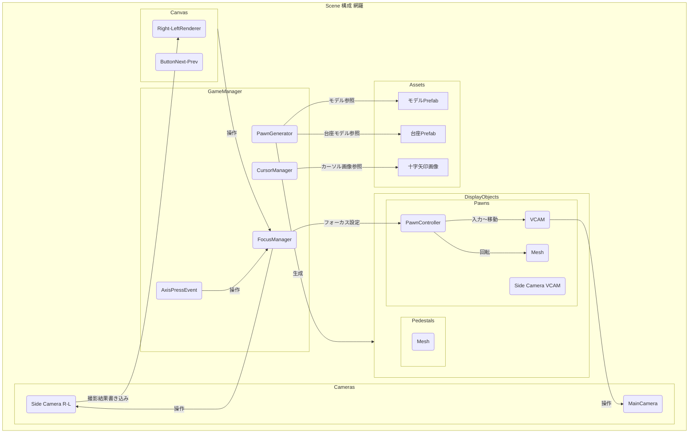
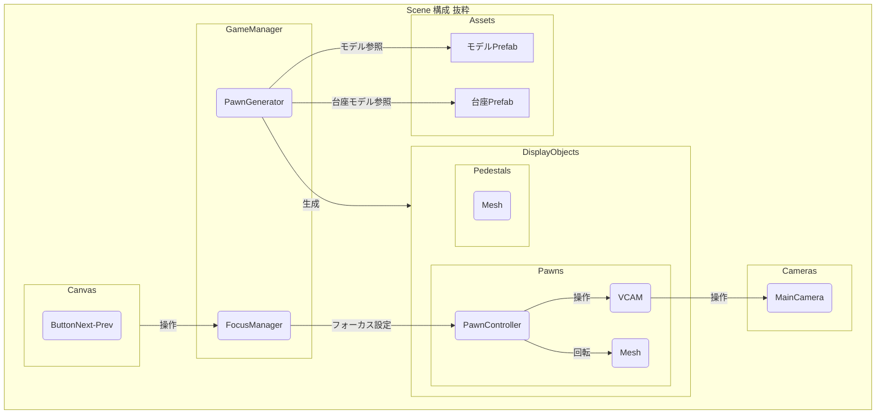
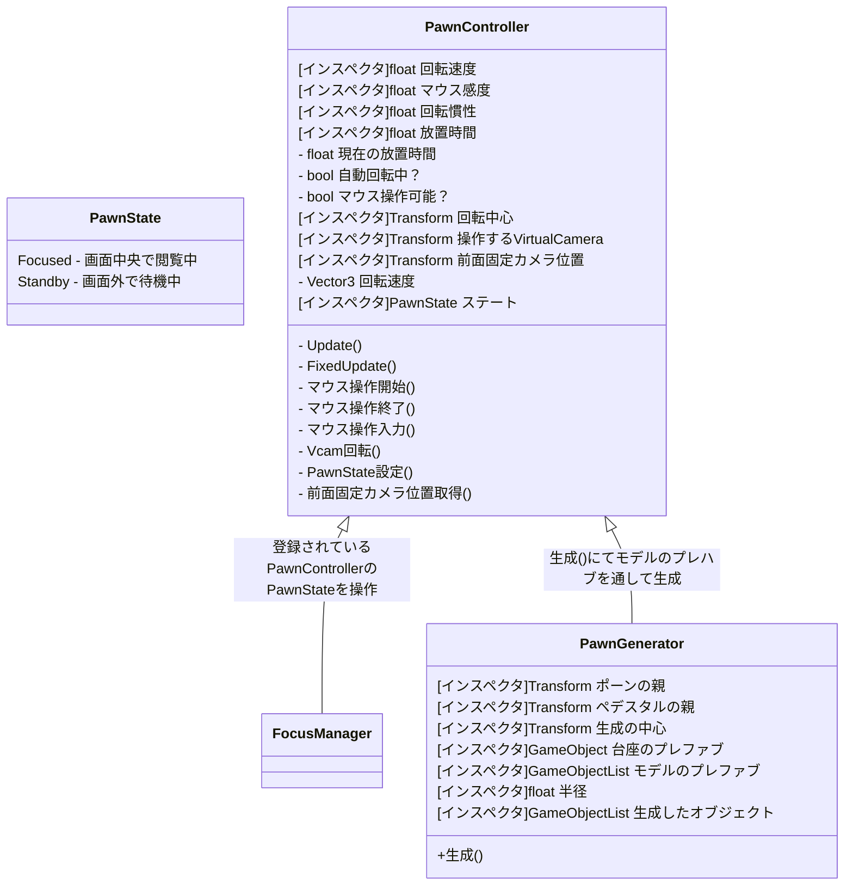

23_2_1_ModelTurnTable
 - Unityでの3Dモデル展示用プロジェクト
# 環境
 - ~~Unity 2021.3.15f1~~
 - 24/11/17更新　：　Unity 2022.3.6f1 LTS に更新
 - Built-inRenderPipeline
 - Cinemachine 2.8.9
 - ~~DOTween 1.2.705~~ (使ってない)
# 使い方
## モデルプレハブのセットアップ

  1. Resources > Prefabs > Pawn を選択。
  2. 右クリック→Create > Prefab Variant でPrefabVariantを作成。
  3. 作成したPrefabVariantを編集。
  4. Pawn > Model 以下にモデルを配置します。

モデルはオブジェクトとして存在できればスクリプトにもアニメーションにも特に規格はありません。ApplyRootMotionのチェックは外しておくとよいでしょう。

## シーンのセットアップ

  1. Scenes > SampleSceneをコピー。
  2. コピーしたシーンを編集。
  3. GameManager > PawnGenerator > Prefabs に作成したモデルプレハブを指定。
  4. GameManager > PawnGenerator > Generateボタン
    - 指定したモデルプレハブが円周上に並べられます。
  5. シーンを再生して動作確認。
# 操作
  - 左クリック
    - モデル回転
  - 画面下部のボタン/左右キー
    - フォーカスするモデルを切り替え

  - 操作をせずに2秒経つと自動で回転します。
    - (モデルオブジェクトPawn > PawnController > NoControllTime　で調整可能)
  - 操作せずに10秒待つと自動でフォーカスするモデルを切り替えます。
    - (GameManager > FocusManager > NoControllTime　で調整可能)
# 調節  
- モデルの高さを調節
GameManager > PawnGenerator > BasePoint に指定されたTransformのローカル座標
- 台座（モデル毎に生成される同一オブジェクト）  
GameManager > PawnGenerator > Pedestal でプレハブ指定。
- 生成する円周の半径を設定  
GameManager > PawnGenerator > Radius で設定。
# 仕様
 - GameManager > PawnGenerator > Generate 時にGenerated内オブジェクトを削除します。
- 生成後に生成オブジェクトをGenerated内にリンクします。
 - GameManager > FocusManager > Pawns内にフォーカス可能なモデルオブジェクトがリンクされます。

# シーン構成　網羅

# シーン構成　抜粋

# クラス　(抜粋の範囲)
